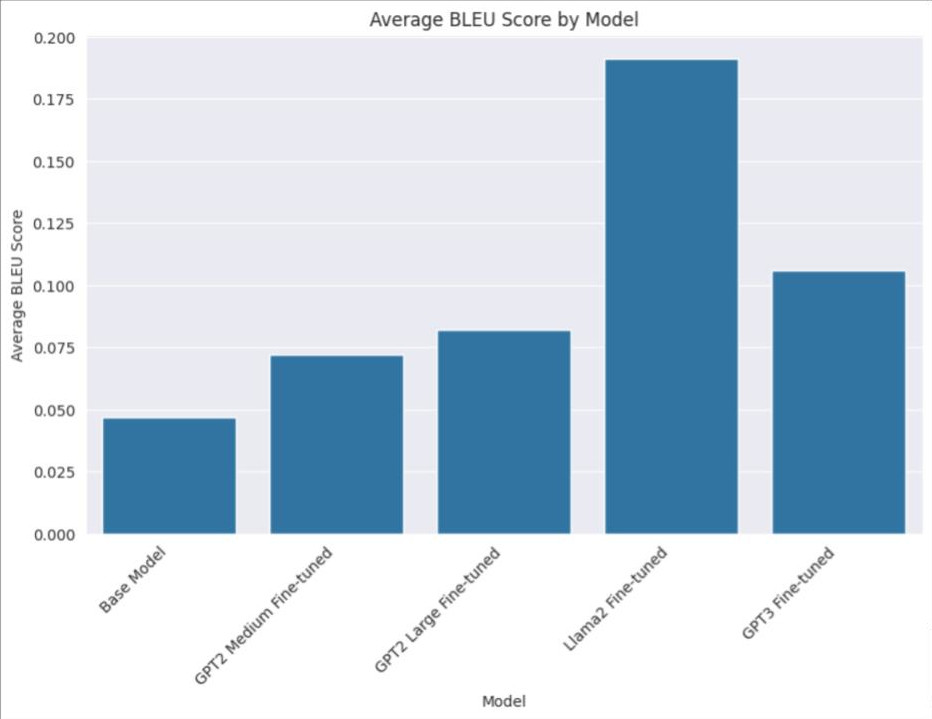
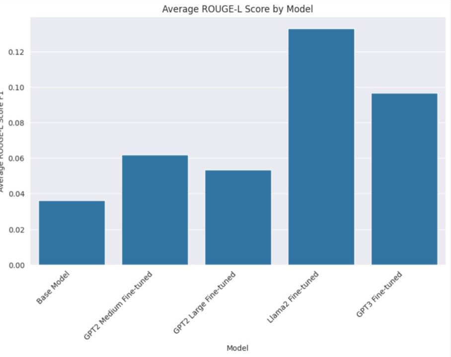
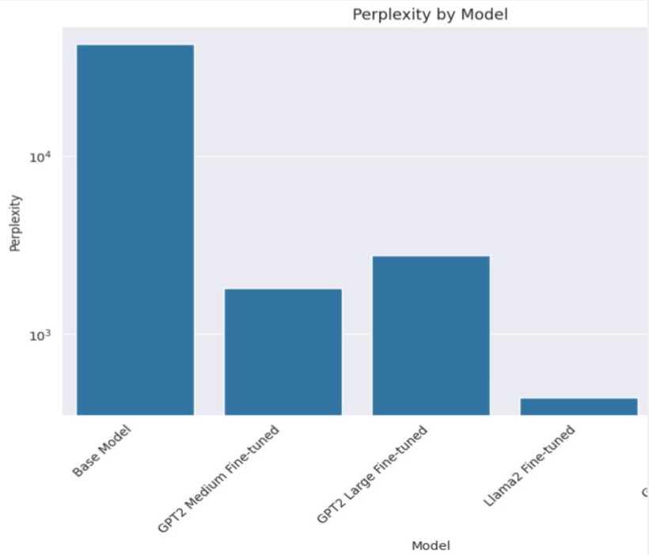

# AAI-520-Final-Project
## Team Members:
- [Shyam Adhikari]()
- [Matthew Sexton](https://github.com/mattwsexton)
- [Jeffrey Thomas](https://github.com/jeffreykthomas/)

## Project Description:
This project aims to build a chatbot using the Ubuntu dataset.

## Project Structure:
```
├── data
│   ├── ubuntu
|   |   ├── train.csv
|   |   ├── test.csv
|   |   ├── valid.csv
|
|-- gpt2_finetuning
|   ├── gpt2_generator_train.py
|
|-- gpt3_finetuning
|   ├── gpt3_create_finetune.py
|   ├── gpt3_upload_data.py
|   ├── prepare_data_openai.py
|
|-- llama2_finetuning
|   ├── llama2_train.py
|-- |-- prepare_data_llama2.py

|-- deployment
|   ├── chatbot_cloud_function.py
|   ├── prepare_llama_to_deploy.py

|-- app.py
|-- README.md
|-- AAI_520_Final_Project.ipynb
```

## Data:
The data used for this project is the Ubuntu Dialogue Corpus v2.0. This dataset contains almost 1 million two-person conversations extracted from chat logs from the Ubuntu channels on the Freenode IRC network. The dataset is available on [github](https://github.com/rkadlec/ubuntu-ranking-dataset-creator).

## GPT-2 Finetuning:
The GPT-2 model was finetuned using the [Huggingface](https://huggingface.co/microsoft/DialoGPT-medium?text=Hey+my+name+is+Thomas%21+How+are+you%3F) library. The model was trained for 3 epochs. The training script can be found in the gpt2_finetuning folder.
We ended up with Dialo from Microsoft, an already fine-tuned gpt2 for dialogue generation. 

We trained both the medium and large sizes of the model.

## GPT-3 Finetuning:
The GPT-3 model was finetuned using the [OpenAI](https://beta.openai.com/) API. The model was trained for a single epoch. The training script can be found in the gpt3_finetuning folder.

## Llama2 Finetuning:
The Llama2 model was finetuned using the [Huggingface](https://huggingface.co/transformers/model_doc/gpt2.html#gpt2lmheadmodel) library. The model was trained for 3 epochs. The training script can be found in the llama2_finetuning folder. In particular, we used QLora for the finetuning process, and then AutoGPTQ to quantize the model for faster inference and easier deployment.

## Results:
### Bleu Score:


### Rouge Score:

### Perplexity:


## Deployment
The deployment of the chatbot was done using Quasar and Google Cloud Functions. Some details of the deployment can be found in the deployment folder. The chatbot can be accessed here: 
[Ubuntu Chat](https://jtdesigns.app/ubuntu-chat)

## References:
1. Norouzi, A. (2023, September 3). Mastering Llama 2: A Comprehensive Guide to Fine-Tuning in Google Colab. Artificial Corner. [Link](https://artificialcorner.com/mastering-llama-2-a-comprehensive-guide-to-fine-tuning-in-google-colab-bedfcc692b7f)
2. Editorial Team. (2023, September 8). GPTQ Quantization on a Llama 2 7B Fine-Tuned Model With HuggingFace. Towards AI. [Link](https://towardsai.net/p/machine-learning/gptq-quantization-on-a-llama-2-7b-fine-tuned-model-with-huggingface)
3. Neskorozhenyi, R. (2020, June 8). Make your own Rick Sanchez (bot) with Transformers and DialoGPT fine-tuning. Teach GPT-2 to write like a mad scientist. Towards Data Science. [Link](https://towardsdatascience.com/make-your-own-rick-sanchez-bot-with-transformers-and-dialogpt-fine-tuning-f55e7c0eec4a)